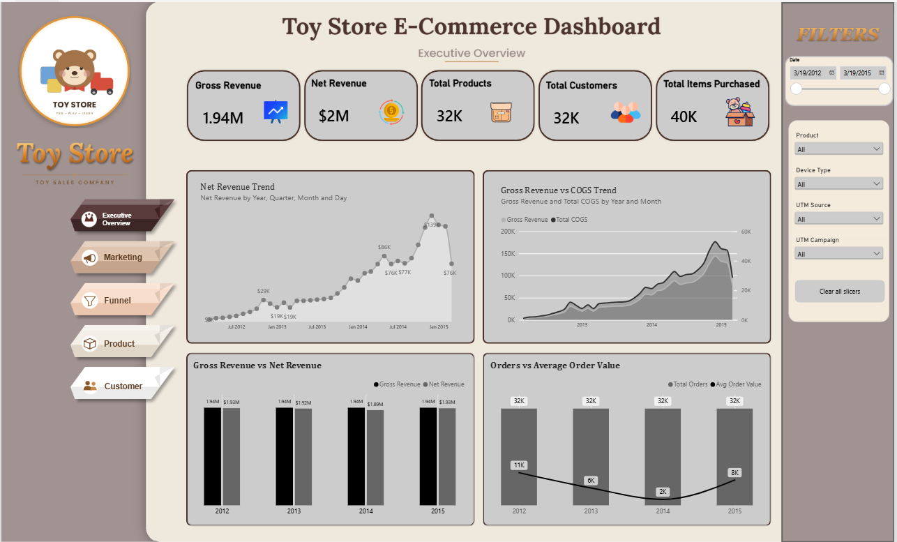
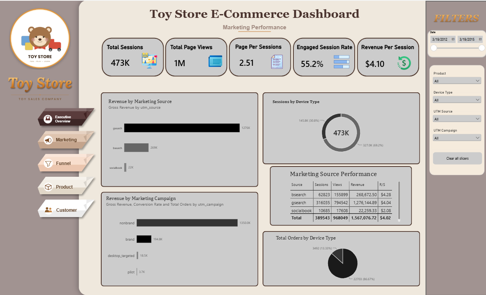
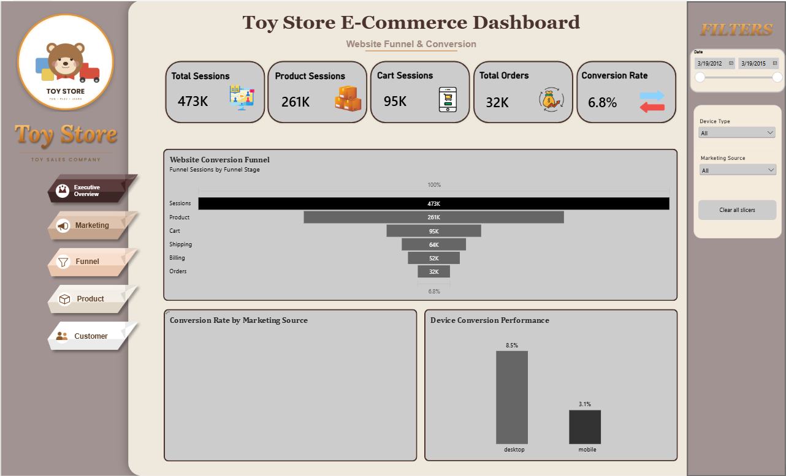
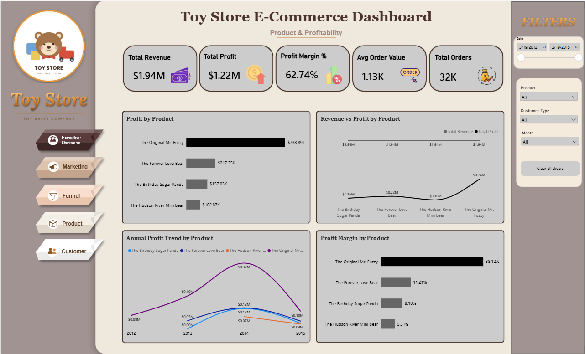
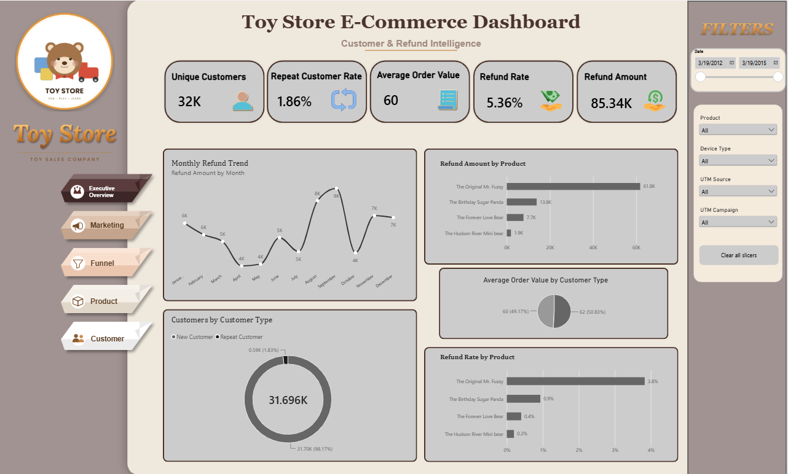

🧸 Toy Store AI Analytics – E-Commerce Business Intelligence Dashboard

An interactive Power BI dashboard combined with a Gemini-powered AI Agent to analyze an e-commerce toy store's performance. The project turns raw order, session, and refund data into meaningful insights through interactive visualizations, dynamic filtering, and a natural-language AI assistant — all accessible from a single link.

🔗 **Live Dashboard (Power BI):** [Open Dashboard](https://app.powerbi.com/view?r=eyJrIjoiMGI1ZjE5ODEtYTdmMy00YmMzLWE0YjUtMmU4MDMzMGE2MDJkIiwidCI6ImM2ZTU0OWIzLTVmNDUtNDAzMi1hYWU5LWQ0MjQ0ZGM1YjJjNCJ9)

🔗 **Live App with AI Agent (Streamlit):** [Open App](https://toystoreaidashboard-fhfhpnf9jdxucquhpdz9hg.streamlit.app/)

📌 Project Overview
Toy Store AI Analytics is a Business Intelligence solution developed in Microsoft Power BI to help track and understand an e-commerce toy store's sales, marketing, website funnel, product profitability, and customer/refund behavior. On top of the dashboard, an AI Agent (built with Google Gemini) lets anyone ask plain-language questions about the data and get instant answers, without needing to know SQL or Power BI.

The project combines data cleaning, transformation, DAX calculations, data modeling, interactive dashboard design, and an AI-powered natural language layer to support data-driven decision-making.

🎯 Business Problem
E-commerce businesses generate large volumes of order, session, and marketing data that is hard to interpret at a glance. Understanding what's driving revenue, where customers are dropping off in the funnel, and which products are most profitable requires digging through multiple reports.

Toy Store AI Analytics solves this by providing a single, interactive dashboard paired with an AI assistant that can answer specific business questions on demand.

🎯 Project Objectives
- Analyze overall e-commerce revenue and profitability trends.
- Track marketing performance across sources, campaigns, and devices.
- Study the website conversion funnel and identify drop-off points.
- Compare product-level profitability and margins.
- Analyze customer behavior, repeat rate, and refund patterns.
- Let users ask natural-language questions about the data via an AI Agent.

📊 Dashboard Pages

📌 Executive Overview
- Gross Revenue, Net Revenue, Total Products, Total Customers, Total Items Purchased KPIs
- Net Revenue Trend
- Gross Revenue vs COGS Trend
- Gross Revenue vs Net Revenue by Year
- Orders vs Average Order Value by Year

📈 Marketing Performance
- Total Sessions, Total Page Views, Page Per Sessions, Engaged Session Rate, Revenue Per Session KPIs
- Revenue by Marketing Source
- Sessions by Device Type
- Revenue by Marketing Campaign
- Marketing Source Performance Table
- Total Orders by Device Type

🔻 Website Funnel & Conversion
- Total Sessions, Product Sessions, Cart Sessions, Total Orders, Conversion Rate KPIs
- Website Conversion Funnel (Sessions → Product → Cart → Shipping → Billing → Orders)
- Conversion Rate by Marketing Source
- Device Conversion Performance

💰 Product & Profitability
- Total Revenue, Total Profit, Profit Margin %, Avg Order Value, Total Orders KPIs
- Profit by Product
- Revenue vs Profit by Product
- Annual Profit Trend by Product
- Profit Margin by Product

👥 Customer & Refund Intelligence
- Unique Customers, Repeat Customer Rate, Average Order Value, Refund Rate, Refund Amount KPIs
- Monthly Refund Trend
- Refund Amount by Product
- Average Order Value by Customer Type
- Customers by Customer Type
- Refund Rate by Product

🤖 AI Agent
Alongside the Power BI dashboard, an AI Agent (powered by Google Gemini) is embedded in the same app. It can:
- Answer data-specific questions (e.g. "refund rate by product") by generating and running SQL queries on the underlying data in real time.
- Answer general questions about the dashboard (e.g. "summarize the executive overview page") using its understanding of what each page contains.
- Explain results in plain, easy-to-understand language alongside the query used.

📂 Dataset Information
The dataset contains detailed e-commerce information including:
- Orders (order id, price, COGS, items purchased)
- Order Items & Refunds
- Products
- Website Sessions (UTM source, campaign, device type)
- Website Pageviews

🛠️ Tools & Technologies
- Microsoft Power BI
- Power Query
- DAX
- Python (Streamlit, Pandas, DuckDB)
- Google Gemini API

✨ Key Features
- Interactive Power BI Dashboard
- AI Agent for natural language Q&A
- Multi-page navigation (Executive, Marketing, Funnel, Product, Customer)
- Interactive Filtering (Date, Product, Device Type, UTM Source, UTM Campaign)
- Advanced DAX Measures
- Single-link access combining dashboard + AI in one app

📸 Dashboard Preview

Executive Overview


Marketing Performance


Website Funnel & Conversion


Product & Profitability


Customer & Refund Intelligence


💡 Key Insights
- Net revenue shows a strong upward trend before leveling off in recent periods.
- A small number of products drive the majority of total profit.
- Mobile sessions convert at a noticeably lower rate than desktop.
- Refunds are concentrated in a handful of products, useful for quality follow-up.
- Repeat customers show different average order value patterns than new customers.

📁 Repository Structure
```
toystore_ai_dashboard
│
├── app.py
├── requirements.txt
├── README.md
├── data
│   ├── orders.csv
│   ├── order_items.csv
│   ├── order_item_refunds.csv
│   ├── products.csv
│   ├── website_sessions.csv.gz
│   └── website_pageviews.csv.gz
└── img
    ├── executiveoverview.png
    ├── marketing.png
    ├── funnel.png
    ├── product.png
    └── customer.png
```

👥 Project Team

👨‍💻 Shubh Srivastava
Role: Data Analyst | Power BI Developer | AI Integration

Responsibilities
- Planned and designed the complete analytics project.
- Built the Executive Overview page.
- Built the Marketing Performance page.
- Built the Customer & Refund Intelligence page.
- Integrated the Google Gemini AI Agent into the dashboard app.
- Managed project deployment and GitHub repository.

📧 Email: shubh200405@gmail.com

💼 LinkedIn: [Shubh Srivastava](https://www.linkedin.com/in/shubh-srivastava-0710593b2/)

💻 GitHub: [shubh200405-coder](https://github.com/shubh200405-coder)

👩‍💻 Liza Deka
Role: Data Analyst | Dashboard Development

Responsibilities
- Built the Product & Profitability page.
- Built the Website Funnel & Conversion page.
- Contributed to the Executive Overview page.
- Reviewed dashboard visuals and business logic for accuracy.

📧 Email: dekaliza98@gmail.com

🤝 Collaboration
This project was completed through collaborative effort, combining Power BI dashboard design, data analysis, and AI integration to deliver a complete analytics solution for e-commerce toy store performance.

🚀 Future Improvements
- Live data integration
- Predictive revenue and refund analytics
- Additional AI Agent capabilities (forecasting, anomaly alerts)
- Mobile-optimized layout

📄 License
This project is licensed under the MIT License.

⭐ Support
If you found this project useful, consider giving it a ⭐ on GitHub.

📬 Contact
For suggestions, collaborations, or professional opportunities, feel free to connect.

Shubh Srivastava
📧 Email: shubh200405@gmail.com

💼 LinkedIn: [Shubh Srivastava](https://www.linkedin.com/in/shubh-srivastava-0710593b2/)

💻 GitHub: [shubh200405-coder](https://github.com/shubh200405-coder)

© 2026 Shubh Srivastava & Liza Deka. All Rights Reserved.
